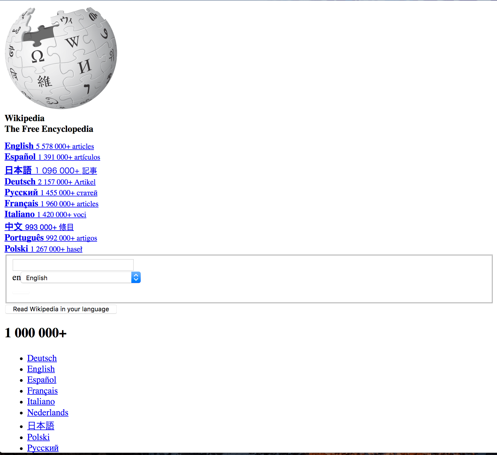
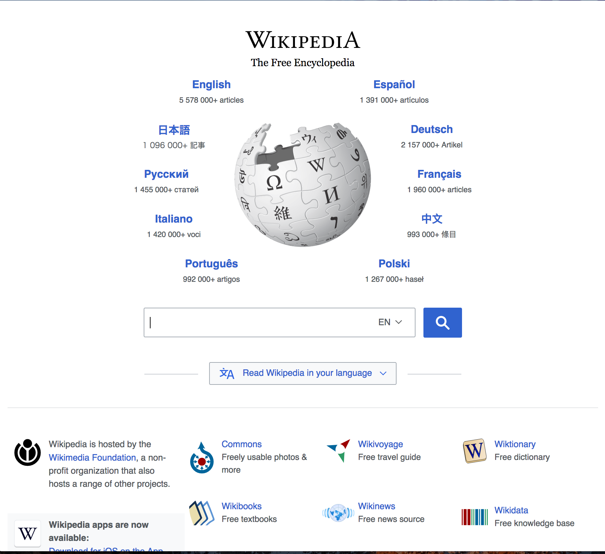

footer: Superposition II - HTML/CSS Workshop
slidenumbers: true

# HTML/CSS Workshop

## Led by Kelsey Karin Hawley
#### sometimes a coding veteran<br>sometimes a coding newb<br>(really depends on the day)

^ Notes: Students should make sure to have an editor (sublime, etc) and web browser open

^ notes for me: have sublime, and incognito chrome stacked on half of screen

[.footer: ]

---
# HTML

HyperText Markup Language

---

HTML - The skeleton of a webpage

^ How many of you know wikipedia?

---
HTML - The skeleton of a webpage



---
# CSS

Cascading Style Sheets

---
CSS - The skin and shape of a webpage

---
CSS - The skin and shape of a webpage



^ Look more familiar now?

---
# Let's start with HTML

---
# HTML elements

Elements are used to structure the content of a page

They consist of tags and content

```html
<tag>content</tag>
```

---
# HTML tags

```html
<tag>content</tag>
```
^ Also make sure you are using those '<' + '>'

Notice that a complete tag is in **2** pieces:
an _opening_ and _closing_ tag

Tags _almost_ always come in pairs

---
# Spacing?

If you know python, you know spaces and newlines matter

HTML and CSS **don't care** about whitespace

But its _good practice_ to use indentation for readability

---
# Code it - <html>
^Every page should start with a doctype and an html tag
^Without an <html>, the browser doesn't know how to read the content of the page.  (is it json? xml?, image?)

Every file should have these:

* _Start_ every HTML document with

```html
<html>
```

^Example of opening tag 

* And _end_ with the matching

```html
</html>
```

^ example of closing tag

^ !! have my editor open and add these tags

---
# Important Note about placing tags

Tags can nest
Be sure to close them in the right order!

```html
<first_tag>
	<second_tag>Some text!<second_tag>
</first_tag>
```

---
# Code it - <body>

```html, [.highlight: 2-4]
<html>
	<body>
	
	</body>
</html>
```

`<body>` will contain all of our _viewable_ webpage content

---
# Code it - <p>

```html, [.highlight: 3]
<html>
	<body>
		<p>My first paragraph</p>
	</body>
</html>
```

`<p>` is the **paragraph** tag

Notice its nested _inside_ the `<body>` tag

^Take a look at the webpage now, don't forget to mention 'refresh'

---
# Code it - <p>

```html, [.highlight: 3]
<html>
	<body>
		<p>My first paragraph</p>
	</body>
</html>
```

Also notice the _text_ inside the `<p>` tag

We can see it on the screen!

^ the contents of a p are displayed to the user

---
# Code it - more <p>

```html, [.highlight: 4]
<html>
	<body>
		<p>My first paragraph</p>
		<p>Another paragraph!</p>
	</body>
</html>
```

This time, we've put it _after_ our first `<p>` tag

Notice it shows up _after_ it in the webpage

---
# Code it - <h1>

^Let's add a header to our page.

```html, [.highlight: 3]
<html>
	<body>
		<h1>This is a header</h1>
		<p>My first paragraph</p>
		<p>Another paragraph!</p>
	</body>
</html>
```

Notice that the text inside is visible again

---
# Code it - <h1>

```html, [.highlight: 3]
<html>
	<body>
		<h1>This is a header</h1>
		<p>My first paragraph</p>
		<p>Another paragraph!</p>
	</body>
</html>
```

Notice this header tag, had the number _1_...

---
# Code it - <h2>

```html, [.highlight: 4]
<html>
	<body>
		<h1>This is a header</h1>
		<h2>Less big header</h2>
		<p>My first paragraph</p>
		<p>Another paragraph!</p>
	</body>
</html>
```

There are more

Each gradually decreases in size

---
# All the <h_>'s

```html, [.highlight: 3-8]
<html>
	<body>
		<h1>Biggest header</h1>
		<h2>Less big header</h2>
		<h3>Big medium header</h3>
		<h4>Small medium header<h4>
		<h5>Smaller header</h5>
		<h6>Smallest header</h6>
	</body>
</html>
```

^All the way to h6

---
# Code it - \<a>

What about links?

---
# Code it - \<a>

What about links?

```html, [.highlight: 5]
<html>
	<body>
		<h1>This is a header</h1>
		<p>My first paragraph</p>
		<a href="https://google.com">Google</a>
		<p>Another paragraph!</p>
	</body>
</html>
```

---
# href ?

---
# HTML Attributes

**Attributes** are modifiers on an html tag

* Some attributes are only on some tags 
(like `href` on `<a>`)

* Others will be on many tags 
(like `class` we'll see later)


---
# HTML Attributes

Usually look something like: 

```html
<tag attribute=”something”></tag>
```

---
# \<a> href?

^ so what is that href?

It stands for "hypertext reference"

We can see in our file, its a link to google

Is that all it can do?

---
# \<a> href

* An external html page

```html
<a href="https://google.com">Google</a>
```

---
# \<a> href

* An external html page

```html
<a href="https://google.com">Google</a>
```

* An external file link

```html
<a href="http://superposition.tech/assets/images/logo.png">Logo</a>
```

---
# \<a> href

* An internal link

```html
<a href="new_page.html">New page</a>
```

* An internal file link

```html
<a href="cartoon.jpg">some random image</a>
```

^Internal linking can be complicated
Showing off absolute vs relative paths will be hard...

---
# Code it - <ul>, <li>

```html
<p>Groceries</p>
<ul>
	<li>Oranges</li>
	<li>Apples</li>
</ul>
```

Each `<li>` (list item) is part of the main `<ul>` (_unordered_ list)

^They are grouped together, and shown as a bulleted list

---
# Code it - <ol>, <li>


```html
<p>Tasks</p>
<ol>
	<li>Wake up</li>
	<li>Brush teeth</li>
	<li>Get dressed</li>
</ol>
```

Each `<li>` (list item) is part of the main `<ol>` (_ordered_ list)

---
# Code it - nesting lists

You can also nest lists

Just be sure close them properly!

---
# Code it - nesting lists

```html
<p>Groceries</p>
<ul>
	<li>Oranges</li>
	<li>Apples
		<ul>
			<li>Fuji</li>
			<li>Pink Lady</li>
		</ul>
	</li>
</ul>
```

---
# Code it - nesting lists

```html
<p>Tasks</p>
<ol>
	<li>Wake up</li>
	<li>Brush teeth</li>
	<li>Get dressed
		<ol>
			<li>Socks on</li>
			<li>Shoes on</li>
		</ol>
	</li>
</ol>
```

---
# Code it - <b>, <i>

Bold and italic texts

```html
<p>Some <b>bold</b> text.  
	And <i>italic</i> too.</p>
```

---
<!--# Code it - <strong>, <em>

Strong and emphasized text, similar to bold and italic

```html
<p>Some <strong>strong</strong> text.  
	And <em>emphasis</em> too.</p>
```

--- -->
# Images

Are a bit special:

* No closing tag
* No inner content
* Require a `src` attribute
* `src` is a link, like with `href`

---
# Code it - 

```html

```
---
# Code it - \<a>, 

You can add a link to your image by nesting in an \<a>

```html
<a href="https://google.com">
	
</a>
```

---
# Code it - comments

You might want to leave notes in your code

These are hidden on the webpage, 
and just seen in the code

```html
<!-- comments galore here -->
```

---
# More body tags you might see

* `<div>` used to format and divide content
* `<table>`, `<tr>`, `<td>` for creating data tables
* Soooo many more

---
# The head

Remember `<body>` was full of the _visible_ bits?

Well, `<head>` has lots of _invisible_ bits

---
# Code it - <head>

```html, [.highlight: 2-4]
<html>
	<head>
	
	</head>
	<body>
		...
```

---
# The head

Head can contain things like:

* page title (seen in the browser tab)
* language (spanish, german, english, ...)
* javascript things
* css things
* search/social media sharing things

---
# Code it - <title>

```html, [.highlight: 2-4]
<html>
	<head>
		<title>Tutorial Page</title>
	</head>
	<body>
		...
```
^ show the browser tab has changed

---
# CSS
---
# CSS Rules

CSS is based on a series of rules

Each rule tells the browser:

* which element
* what part of the element is affected
* how it is affected

---
# CSS Rules
```css
p {
	color: green;
}
```

---
# CSS Rules
```css
p {
	color: green;
}
```
Notice the syntax

* '**{**' and '**}**' surround the _properties_
* each _property name_ is followed by a '**:**'
* each _property value_ is followed by a '**;**'

---
# CSS Rules
```css, [.highlight: 1, 3]
p {
	color: green;
}
```

**p** is the _selector_

Says which element the rule is touching

Here, all `<p>` tags would be affected

---
# CSS Rules
```css, [.highlight: 2]
p {
	color: green;
}
```

**color** is the _property name_ 
**green** is the _property value_

---
# CSS Rules
```css, [.highlight: 2]
p {
	color: green;
}
```

The how and what part of the element

The _color_ will be affected by appearing _green_

---
# CSS Rules
```css
p {
	color: green;
}
```

As a whole, the rule reads:

All `<p>` tags will be **green** in **color**

---
# Okay, but where does that go?

---
# CSS options

Three ways to add CSS to your HTML:

* inline
* in a style tag
* linking an external file

---
# CSS options

Three ways to add CSS to your HTML:

* ~~inline~~
* in a style tag
* ~~linking an external file~~

^ not gonna cover those in thise workshop

---
# CSS style tag
Let's add a `style` tag to our `head`

```html, [.highlight: 3-5]
<html>
	<head>
		<style>
		
		</style>
	</head>
	...
```

---
# CSS style tag

Now let's add that CSS rule from earlier

```html, [.highlight: 3-7]
<html>
	<head>
		<style>
			p {
				color: green;
			}
		</style>
	</head>
	...
```

---
# What if I only want **one** green <p>?

---
# More selectors - classes

`class` is an attribute for any html element

You can group elements in different ways

---
# More selectors - classes

```html
<p class="green">Another paragraph!</p>
```

---
# More selectors - classes
```css
p.green {
	color: green;
}
```	

`.green` says the `<p>` will have a `green` class

^Reload page with green text only on that paragraph now

---
# More selectors - classes

```html
<p class="green bordered">Another paragraph!
	<i class="bordered">Italic</i>
</p>
<p class="special>Special paragraph</p>

```

You can add multiple classes to an element

Just separate them with a space

---
# More selectors - classes
```css
p.green, .special {
	color: green;
}
.bordered {
	border: 1px solid black;
}
```	
You add multiple class selectors to a rule

Even leaving off an element

^Reload page to show off

---
# More ways to select

* ids (`#so-special`)
* pseudo-classes (`:link`, `:active`, `:hover`, etc)
* attributes (`[href*="google"]`)
* siblings ( `a + p`)
* children ( `p > i`)
* descendants ( `p i`)

---
# Further Resources

[MDN HTML](https://developer.mozilla.org/en-US/docs/Web/HTML)
[MDN CSS](https://developer.mozilla.org/en-US/docs/Web/CSS)

[W3Schools HTML](https://www.w3schools.com/html/default.asp)
[W3Schools CSS](https://www.w3schools.com/css/default.asp)

[CSS Box Model](https://developer.mozilla.org/en-US/docs/Web/CSS/CSS_Box_Model/Introduction_to_the_CSS_box_model)

[Boostrap](https://getbootstrap.com/)